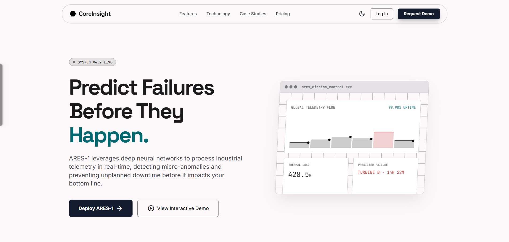
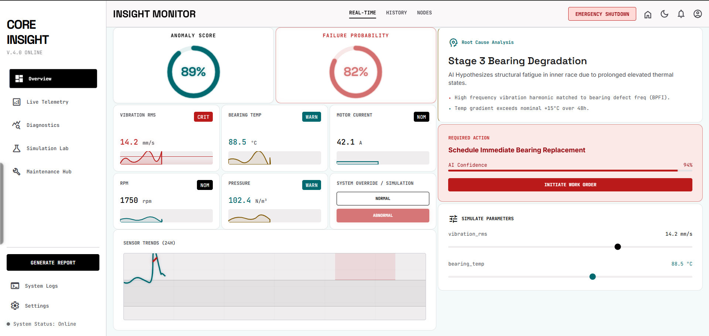

<div align="center">

# ⚡ CoreInsight AI Anomaly Detection System

**A cyber-industrial predictive maintenance platform combining real-time ML inference with a full-stack operator dashboard.**

[](https://nextjs.org/)
[](https://fastapi.tiangolo.com/)
[](https://www.python.org/)
[](https://www.typescriptlang.org/)
[](https://scikit-learn.org/)
[](https://tailwindcss.com/)

[⚡👉 Live Demo](https://coreinsight-nine.vercel.app/)

</div>

---

## 📖 Overview

CoreInsight is a production-style **predictive maintenance and anomaly detection system** for industrial machinery. It ingests multivariate sensor telemetry (vibration, temperature, pressure, flow, current) and runs two ML models in real time to:

- **Detect anomalies** using an Isolation Forest scorer
- **Predict near-term failure probability** using a Random Forest Classifier
- **Identify root causes** using a rule-based + correlation Root Cause Analyzer
- **Generate operator decisions** using a fused multi-signal Decision Engine
- **Stream live scores** over WebSocket and NDJSON protocols

All outputs are rendered in a high-fidelity cyber-industrial **Next.js dashboard** with dark/light themes, responsive mobile layout, and interactive simulation tools.

---

## 🖥️ Screenshots

### 🏠 Landing Page


### 📊 Overview


### 🧠 AI / ML Engine
- **Isolation Forest** anomaly detector trained on 8,000 steps of synthetic industrial sensor data
- **Random Forest Classifier** (300 trees, balanced subsample) predicting failure probability within a 48-step horizon
- **Weighted Decision Fusion** combining failure signal (46%), anomaly signal (34%), and RCA confidence (20%)
- **Z-Score Deviation Profiling** for local anomaly driver identification
- **Rule-Based RCA** isolating bearing degradation, hydraulic restriction, and mechanical imbalance

### ⚡ Real-time Streaming
- **WebSocket endpoint** (`/ws/anomaly-stream`) pushing tick-by-tick sensor scores
- **NDJSON streaming** (`/stream/anomaly-ndjson`) for lightweight client polling
- **Rolling Sensor Buffer** maintaining a 64-step context window for continuous inference

### 🎛️ Operator Dashboard
- **Anomaly Score & Failure Probability Gauges** — neon-styled radial dials
- **10-Channel Parameter Table** with color-coded status (✅ Normal / ⚠️ Warning / 🔴 Critical)
- **Telemetry Strip Charts** — server-rendered Matplotlib PNG charts with annotated anomaly cues
- **What-If Simulation** — slider-based sensor perturbation with live risk comparison
- **AI Diagnostic Terminal** — chat-style root cause narration with syntax-highlighted payloads
- **Maintenance Hub** — active work orders, inventory status, downtime windows, 3D asset visualizer

### 📱 Responsive & Mobile-Ready
- Bottom navigation bar for seamless mobile routing
- Desktop sidebar hidden below `md` breakpoint
- Canvas particle animation optimized for small screens

---

## 🏗️ Architecture

```
┌────────────────────────────────────────────────────────────────┐
│                      CoreInsight System                        │
│                                                                │
│  ┌─────────────────────┐      ┌─────────────────────────────┐  │
│  │  Next.js Frontend   │      │      FastAPI Backend        │  │
│  │  (Vercel Deployed)  │◄────►│      (Port 8000)            │  │
│  │                     │ REST │                             │  │
│  │  • Dashboard        │  WS  │  ┌────────────────────────┐ │  │
│  │  • Telemetry        │      │  │   TechnicalAssistant   │ │  │
│  │  • Diagnostics      │      │  │   (Orchestrator)       │ │  │
│  │  • Simulation Lab   │      │  │                        │ │  │
│  │  • Maintenance Hub  │      │  │  AnomalyDetector       │ │  │
│  │  • Landing Page     │      │  │  FailurePredictor      │ │  │
│  └─────────────────────┘      │  │  RootCauseAnalyzer     │ │  │
│                               │  │  DecisionEngine        │ │  │
│                               │  └────────────────────────┘ │  │
│                               │                             │  │
│                               │  Synthetic Sensor Simulator │  │
│                               │  (8000 steps, 1-min freq)   │  │
│                               └─────────────────────────────┘  │
└────────────────────────────────────────────────────────────────┘
```

### ML Pipeline

```
Raw Sensor Stream (6 channels × 1-min ticks)
        │
        ▼
┌───────────────────┐
│   Preprocessing   │  validate → ffill/bfill → cast float
└────────┬──────────┘
         │
         ▼
┌───────────────────┐
│  Rolling Window   │  64-step context window (FIFO deque)
└────────┬──────────┘
         │
         ▼
┌───────────────────┐
│ Feature Pipeline  │  [mean, std, min, max, last] × 6 channels
│  (30-dim vector)  │  = 30 features per inference call
└────────┬──────────┘
         │
    ┌────┴──────┐
    ▼           ▼
┌──────────┐  ┌──────────────────────┐
│Isolation │  │  Random Forest       │
│Forest    │  │  Classifier (n=300)  │
│(anomaly) │  │  (failure prob.)     │
└────┬─────┘  └───────────┬──────────┘
     │                    │
     └─────────┬──────────┘
               │
               ▼
┌──────────────────────────────┐
│       DecisionEngine         │
│  R = 0.46·s_f + 0.34·s_a     │
│      + 0.20·s_r              │
│  → Low / Medium / High       │
└──────────────────────────────┘
```

---

## 🗂️ Project Structure

```
AI_ANOMALY_DETECTION/
│
├── main.py                      # FastAPI entry point + lifespan model training
├── app.py                       # Streamlit chat-style assistant UI (Demo)
├── requirements.txt             # Backend Python dependencies
│
├── api/
│   ├── routes.py                # REST: /predict, /analyze, /decision, /explain, /whatif
│   ├── schemas.py               # Pydantic request/response schemas
│   └── stream_routes.py         # WebSocket + NDJSON streaming
│
├── data/
│   ├── synthetic.py             # IndustrialSensorSimulator (batch history)
│   └── stream_simulator.py      # IndustrialRealtimeSimulator (tick-by-tick)
│
├── services/
│   ├── assistant.py             # TechnicalAssistant orchestrator
│   ├── anomaly_service.py       # IsolationForest wrapper
│   ├── failure_service.py       # RandomForestClassifier wrapper
│   ├── decision_engine.py       # Fused composite risk & confidence scoring
│   ├── rca.py                   # Rule-based Root Cause Analyzer
│   ├── features.py              # FeaturePipeline (sliding window aggregation)
│   ├── preprocessing.py         # Sensor window validation & imputation
│   ├── explainability.py        # Z-score deviations & RF feature importances
│   ├── insight_presenter.py     # Human-readable narrative builder
│   ├── analyze_charts.py        # Matplotlib PNG chart generator
│   ├── enrichment.py            # Derived channels (RPM, torque, voltage)
│   ├── param_bands.py           # Nominal operating bands & critical thresholds
│   ├── stream_buffer.py         # RollingSensorBuffer (FIFO deque)
│   └── decision_log.py          # Append-only NDJSON decision audit logger
│
├── utils/
│   └── config.py                # Pydantic Settings (env prefix: TA_)
│
├── models/                      # Model artifact directory (auto-created)
├── logs/                        # Decision log files (auto-created)
│
├── tests/
│   ├── test_analyze_charts.py
│   ├── test_decision_engine.py
│   ├── test_loader.py
│   ├── test_preprocessing.py
│   ├── test_rca.py
│   └── test_stream_routes.py
│
└── frontend/
    ├── src/
    │   ├── app/
    │   │   ├── page.tsx                  # Landing page
    │   │   ├── dashboard/                # Overview gauges & parameter grid
    │   │   ├── telemetry/                # Live telemetry chart strips
    │   │   ├── diagnostics/              # AI diagnostic terminal
    │   │   ├── simulation-lab/           # What-if scenario planner
    │   │   └── maintenance-hub/          # Work orders, inventory, asset viewer
    │   │
    │   ├── components/
    │   │   ├── AppContext.tsx             # Global theme & state provider
    │   │   └── layout/
    │   │       └── BottomNavbar.tsx       # Mobile bottom navigation bar
    │   │
    │   └── stitch_components/            # Dark + light theme component variants
    │
    ├── package.json
    └── next.config.ts
```

---

## 🛠️ Tech Stack

| Layer | Technology | Version |
|---|---|---|
| **Frontend Framework** | Next.js (App Router) | 16.2.6 |
| **UI Library** | React | 19.2.4 |
| **Language** | TypeScript | 5.0+ |
| **Styling** | Tailwind CSS | 4.0 |
| **Charts** | Recharts | 3.8.1 |
| **Animations** | Framer Motion | 12.38.0 |
| **Icons** | Lucide React | 1.16.0 |
| **Backend Framework** | FastAPI | 0.109.0 |
| **ASGI Server** | Uvicorn | 0.27.0 |
| **Schema Validation** | Pydantic + Pydantic Settings | 2.5.0 |
| **ML — Anomaly Detection** | Scikit-Learn IsolationForest | 1.3.0 |
| **ML — Failure Prediction** | Scikit-Learn RandomForestClassifier | 1.3.0 |
| **Data Processing** | Pandas + NumPy | 2.0.0 / 1.24.0 |
| **Server-side Charts** | Matplotlib (Agg backend) | 3.7.0 |
| **Deployment** | Vercel (Frontend) | — |
| **Testing** | Jest (Frontend) + pytest (Backend) | 30.4.2 / latest |


---

## 🚀 Getting Started

### Prerequisites

- **Python 3.11+**
- **Node.js 20+**
- **npm 10+**

---

### 2. Backend Setup

```bash
# Create and activate a virtual environment
python -m venv venv

# Windows
venv\Scripts\activate

# macOS / Linux
source venv/bin/activate

# Install Python dependencies
pip install -r requirements.txt
```

**Optional: Create a `.env` file to override defaults**

```env
TA_API_PORT=8000
TA_TRAINING_ROWS=8000
TA_SIMULATION_SEED=42
TA_ANOMALY_CONTAMINATION=0.05
```
> The server automatically trains both ML models on startup before accepting requests.

**Interactive API docs available at:**
- Swagger UI: [http://localhost:8000/docs](http://localhost:8000/docs)
- ReDoc: [http://localhost:8000/redoc](http://localhost:8000/redoc)

---

### 3. Frontend Setup

```bash
cd frontend

# Install dependencies
npm install

# Start the development server
npm run dev
```

Open [http://localhost:3000](http://localhost:3000) in your browser.

---

### 5. Running Tests

**Backend:**
```bash
pytest tests/ -v
```

**Frontend:**
```bash
cd frontend
npm test
```

**Frontend production build:**
```bash
cd frontend
npm run build
```

---


### Monitored Sensor Channels

| Channel | Unit | Normal Band | Critical Range |
|---|---|---|---|
| `vibration_rms` | mm/s | 0.8 – 6.8 | < 0.4 or > 10.5 |
| `bearing_temp_c` | °C | 38.0 – 72.0 | < 32.0 or > 88.0 |
| `motor_current_a` | A | 11.0 – 28.0 | < 9.0 or > 34.0 |
| `flow_rate_l_min` | L/min | 72.0 – 205.0 | < 55.0 or > 230.0 |
| `pressure_bar` | bar | 3.85 – 5.45 | < 3.25 or > 6.1 |

### Decision Risk Tiers

| Risk Level | Condition |
|---|---|
| 🔴 **High** | Failure probability ≥ 0.65 OR composite R ≥ 0.55 |
| 🟡 **Medium** | Failure probability ≥ 0.35 OR 0.28 ≤ R < 0.55 |
| 🟢 **Low** | Composite R < 0.28 |

### Composite Risk Formula

```
R = w_f × s_f  +  w_a × s_a  +  w_r × s_r

where:
  s_f  = failure_probability (from RandomForest)
  s_a  = normalized anomaly score (from IsolationForest)
  s_r  = RCA hypothesis confidence

Weights: w_f = 0.46, w_a = 0.34, w_r = 0.20
```

---

## 🤝 Contributing

1. **Fork** the repository
2. **Create** a feature branch: `git checkout -b feature/your-feature-name`
3. **Commit** your changes: `git commit -m "feat: add your feature"`
4. **Push** to the branch: `git push origin feature/your-feature-name`
5. **Open a Pull Request**

## 📄 License

This project is licensed under a custom **Attribution-NonCommercial License** (CoreInsight). You are permitted to fork, modify, and run this project for personal and educational display purposes. However, you must maintain original authorship attribution (crediting Arpan Hait & Md Saad Bin Kabir), and you may not use it or any derivative works for commercial purposes.

See the [LICENSE](LICENSE) file for the full terms.

---
<div align="center">

### ⚡ CoreInsight System Developers

| Frontend Developer | Backend Developer |
| :---: | :---: |
| **Arpan Hait** | **Md Saad Bin Kabir** |
| [](https://github.com/ArpanHait) | [](https://github.com/Pmskabir1234) |

</div>
